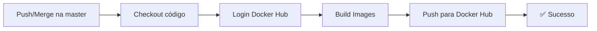

# 🐳 GitHub Actions - Build and Push Docker Images

Este workflow automaticamente faz build e push das imagens Docker para o Docker Hub sempre que há um merge/push na branch `master`.

## 📋 Pré-requisitos

Você precisa ter:
1. Uma conta no [Docker Hub](https://hub.docker.com/)
2. Um repositório privado ou público no Docker Hub
3. Credenciais configuradas no GitHub Secrets

## ⚙️ Configuração

### 1️⃣ Adicionar Secrets no GitHub

Acesse seu repositório no GitHub:
1. Vá para **Settings** → **Secrets and variables** → **Actions**
2. Clique em **New repository secret**
3. Adicione os seguintes secrets:

| Secret | Valor |
|--------|-------|
| `DOCKER_USERNAME` | Seu usuário do Docker Hub |
| `DOCKER_PASSWORD` | Seu token de acesso do Docker Hub |

### 2️⃣ Gerar Access Token no Docker Hub

Se você não tiver um token:
1. Acesse [Docker Hub](https://hub.docker.com/)
2. Vá para **Account Settings** → **Security**
3. Clique em **New Access Token**
4. Dê um nome: `github-actions`
5. Copie o token e salve no GitHub Secrets

## 🚀 Como Funciona

O workflow:



### Etapas:

1. **Trigger**: Quando há `push` ou `merge` na branch `master`
2. **Build**: Faz build de 4 imagens em paralelo:
   - `identity-api`
   - `properties-api`
   - `sensors-api`
   - `alerts-api`
3. **Push**: Envia para Docker Hub com tags:
   - `:latest` (última versão)
   - `:SHORT_SHA` (versão baseada no commit)
4. **Cache**: Usa cache do Docker Hub para builds mais rápidos

## 📦 Tags das Imagens

Cada imagem terá duas tags no Docker Hub:

```bash
# Latest (sempre a versão mais recente)
docker pull seu-usuario/agrosolution-identity-api:latest

# Versão específica (baseada no commit)
docker pull seu-usuario/agrosolution-identity-api:a1b2c3d
```

## 🔍 Monitorar o Workflow

1. Acesse seu repositório no GitHub
2. Clique em **Actions**
3. Procure pelo workflow **"Build and Push Docker Images"**
4. Clique para ver os detalhes e logs

## 📚 Exemplo de Uso

Depois que as imagens estão no Docker Hub, você pode usá-las:

```yaml
# docker-compose.yml
version: '3.8'
services:
  identity-api:
    image: seu-usuario/agrosolution-identity-api:latest
    ports:
      - "8081:8081"
    # ... resto da config
```

Ou na CLI:

```bash
docker run -p 8081:8081 seu-usuario/agrosolution-identity-api:latest
```

## 🐛 Troubleshooting

### Erro: "invalid username/password"
- Verifique se os secrets `DOCKER_USERNAME` e `DOCKER_PASSWORD` estão corretos
- Regenere o token no Docker Hub se necessário

### Erro: "Dockerfile not found"
- Verifique se todos os Dockerfiles existem nos caminhos especificados

### Build muito lento
- Use a cache do Docker Hub (já configurada no workflow)
- Considere aumentar o timeout nos jobs

## 🔐 Segurança

- ✅ Credenciais armazenadas com segurança nos GitHub Secrets
- ✅ Não são expostas nos logs do workflow
- ✅ Use tokens de acesso, não sua senha do Docker Hub
- ✅ Regenere tokens periodicamente

## 📝 Eventos que Triggeram o Workflow

Atualmente, o workflow é acionado por:
- `push` na branch `master`

Para adicionar mais eventos, edite `.github/workflows/docker-build-push.yml`:

```yaml
on:
  push:
    branches:
      - master
  pull_request:  # Também fazer build em PRs
    branches:
      - master
```

## 🎯 Próximas Melhorias (Opcionais)

Se desejar, pode adicionar:

1. **Versioning semântico**: Use tags como `v1.0.0`
2. **Notificações**: Slack, Discord, email ao completar
3. **Testes**: Rodar testes antes de fazer build
4. **Scan de segurança**: Verificar vulnerabilidades nas imagens
5. **Release Notes**: Gerar automaticamente

## 📞 Suporte

Se tiver dúvidas sobre o workflow, consulte:
- [GitHub Actions Documentation](https://docs.github.com/en/actions)
- [Docker Build and Push Action](https://github.com/docker/build-push-action)
